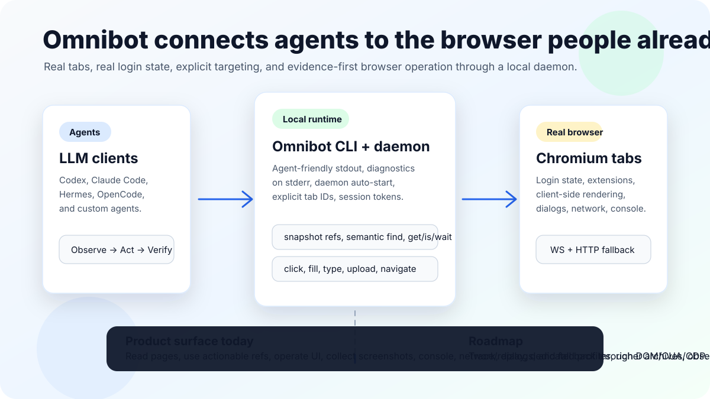

# Omnibot

Browser infrastructure for AI agents.

Omnibot lets LLM clients read, inspect, operate, debug, and verify the user's real Chromium browser: real tabs, real login state, real extensions, and explicit tab targeting through a local daemon plus CLI.



This page is a product-level overview of the current Omnibot surface and the roadmap. For detailed implementation status, see [`docs/product-roadmap.md`](product-roadmap.md).

## Quick Start

Install the CLI:

```bash
npm install -g omnibot
```

Check the local runtime and extension connection:

```bash
omnibot doctor
omnibot status
omnibot tabs
```

Install agent skills so AI clients learn the right operation patterns:

```bash
omnibot skills install --agent codex
omnibot skills install --agent claude
omnibot skills install --agent opencode
omnibot skills install --agent hermes --profile nuwa
```

Observe a tab, act once, then verify:

```bash
OMNIBOT_SESSION_TOKEN=checkout omnibot snapshot -i --tab-id <TAB_ID>
OMNIBOT_SESSION_TOKEN=checkout omnibot click --tab-id <TAB_ID> @e4
OMNIBOT_SESSION_TOKEN=checkout omnibot snapshot -i --tab-id <TAB_ID>
```

## What It Is

Omnibot is a local bridge between agent runtimes and a browser the user is already using. It is designed for tasks where ordinary HTTP fetches or static scraping are not enough:

- Authenticated apps and dashboards.
- Client-rendered pages.
- Sites with rich controls, popups, comboboxes, modals, dialogs, and editors.
- Workflows that need screenshots, console logs, network evidence, or tab-aware state.
- Agent operations that should be explicit, inspectable, and recoverable.

The core product rule is simple:

```text
Observe -> Act -> Verify
```

Agents should inspect the page, take one intentional action, and verify the expected state change before continuing.

## Current Capabilities

### Runtime And Distribution

Omnibot v2 includes a local CLI and daemon runtime. The CLI can auto-start or connect to the daemon, while the browser extension maintains the browser-side connection.

Current surface:

- `omnibot doctor`, `status`, `start`, `stop`, and `run`.
- Local daemon API on `127.0.0.1:18764`.
- Browser extension WebSocket connection on `127.0.0.1:18765`.
- HTTP long-poll fallback on `127.0.0.1:18766`.
- npm distribution through a main CLI package and platform-specific binary packages.
- Packaged agent skills and `omnibot skills install`.

### Reading And Page Understanding

Omnibot gives agents several ways to inspect browser state, depending on intent.

Use `read` when the goal is content understanding:

```bash
OMNIBOT_SESSION_TOKEN=research omnibot read --screens 5 --tab-id <TAB_ID>
OMNIBOT_SESSION_TOKEN=research omnibot read --screens 3 https://example.com/article
```

Use `snapshot -i` when the next step is browser operation:

```bash
OMNIBOT_SESSION_TOKEN=checkout omnibot snapshot -i --tab-id <TAB_ID>
```

Current reading features include:

- Clean rendered-page reading with screen budgets and JSON/text output.
- Accessibility-tree snapshots with actionable `@eN` refs.
- Interactive filtering, compact/depth/url options, and selector scoping.
- Popup/modal controls and combobox option probing.
- Rich text editor refs for contenteditable editors.
- Narrow state reads through `get` and `is`.
- Semantic `find` locators for role, text, label, placeholder, alt, title, test id, and nth matching.

### User-Like Browser Operations

Omnibot can operate the page through refs, semantic locators, selectors, DOM fallback, and coordinate fallback.

Common commands:

```bash
OMNIBOT_SESSION_TOKEN=checkout omnibot click --tab-id <TAB_ID> @e4
OMNIBOT_SESSION_TOKEN=checkout omnibot fill --tab-id <TAB_ID> @e2 "a@b.com"
OMNIBOT_SESSION_TOKEN=search omnibot type --tab-id <TAB_ID> @e3 "omnibot"
OMNIBOT_SESSION_TOKEN=checkout omnibot wait --url "/dashboard" --tab-id <TAB_ID>
```

Implemented operation surface includes:

- `click`, `dblclick`, `fill`, `type`, `press`, `hover`, `focus`.
- `select`, `check`, `uncheck`, `scroll`, `scrollintoview`.
- Element-level drag.
- File upload through CDP, DOM node fallback, and JS `DataTransfer` fallback.
- Navigation, tab lifecycle, window creation, frame targeting, history, reload, and pushstate.
- Waits for selector, text, URL, load state, JavaScript function, and fixed time.
- JSON and file-driven batch commands.

### Debugging And Evidence

Omnibot treats evidence as part of the browser workflow, not an afterthought.

Implemented evidence tools include:

- Screenshots: normal, full-page, annotated, PNG/JPEG, base64, and file output.
- Console capture: logs, error path, and clear.
- JavaScript dialogs: logs, clear, accept, dismiss, and prompt text handling.
- Network capture: start, stop, clear, logs, and summary.
- Raw CDP calls for last-resort inspection.

Example:

```bash
OMNIBOT_SESSION_TOKEN=debug omnibot screenshot --tab-id <TAB_ID> -o /tmp/page.png
OMNIBOT_SESSION_TOKEN=debug omnibot console logs --tab-id <TAB_ID>
OMNIBOT_SESSION_TOKEN=debug omnibot network summary --tab-id <TAB_ID>
```

### Fallback Surfaces

The happy path is semantic locator or snapshot ref. When that fails, Omnibot exposes lower-level surfaces instead of forcing agents directly into raw JavaScript.

Current fallback tiers include:

- Selector operations.
- DomCUA visible-node operations.
- Coordinate mouse operations through CDP input events.
- Clipboard read/write through page context.
- Viewport get/set.
- Asset metadata list/export.
- Browser/session metadata.
- Site-skill exploration and generated operation memory.

## Architecture

Omnibot has four main pieces:

1. The agent client calls `omnibot` commands.
2. The CLI connects to or starts the local daemon.
3. The daemon maintains browser sessions and dispatches actions.
4. The Chromium extension connects real browser tabs to the daemon.

Page-state commands require explicit tab targeting:

```bash
OMNIBOT_SESSION_TOKEN=<workflow> omnibot snapshot -i --tab-id <TAB_ID>
```

`OMNIBOT_SESSION_TOKEN` isolates workflow state such as refs, traces, recordings, aliases, and temporary resources. `--tab-id` chooses the actual browser tab. Refs such as `@e4` are tab-scoped and should not be reused across tabs.

## Typical Workflows

### Inspect And Click

```bash
omnibot tabs
OMNIBOT_SESSION_TOKEN=checkout omnibot snapshot -i --tab-id <TAB_ID>
OMNIBOT_SESSION_TOKEN=checkout omnibot click --tab-id <TAB_ID> @e4
OMNIBOT_SESSION_TOKEN=checkout omnibot snapshot -i --tab-id <TAB_ID>
```

### Read An Authenticated Page

```bash
OMNIBOT_SESSION_TOKEN=research omnibot read --screens 5 --tab-id <TAB_ID>
```

### Debug A Broken Flow

```bash
OMNIBOT_SESSION_TOKEN=debug omnibot console clear --tab-id <TAB_ID>
OMNIBOT_SESSION_TOKEN=debug omnibot network clear --tab-id <TAB_ID>
OMNIBOT_SESSION_TOKEN=debug omnibot network start --tab-id <TAB_ID>
OMNIBOT_SESSION_TOKEN=debug omnibot click --tab-id <TAB_ID> @e7
OMNIBOT_SESSION_TOKEN=debug omnibot network stop --tab-id <TAB_ID>
OMNIBOT_SESSION_TOKEN=debug omnibot console logs --tab-id <TAB_ID>
OMNIBOT_SESSION_TOKEN=debug omnibot network summary --tab-id <TAB_ID>
```

### Operate Rich Controls

```bash
OMNIBOT_SESSION_TOKEN=editor omnibot snapshot -i --tab-id <TAB_ID>
OMNIBOT_SESSION_TOKEN=editor omnibot fill --tab-id <TAB_ID> @e12 "First paragraph.\n\nSecond paragraph."
```

`snapshot -i` can expose popup controls, custom combobox options, and rich text editors that are missing from the normal accessibility tree.

## Command Examples

This section maps the product surface to concrete commands. Most page-state commands use both `OMNIBOT_SESSION_TOKEN` and `--tab-id <TAB_ID>` so agents keep workflow memory separate from the browser tab they are operating.

### Runtime, Health, And Version

```bash
omnibot doctor
omnibot status
omnibot start
omnibot stop
omnibot run
omnibot version
```

### Tab Discovery And Targeting

```bash
omnibot tabs
OMNIBOT_SESSION_TOKEN=research omnibot tab list
OMNIBOT_SESSION_TOKEN=research omnibot tab new https://docs.example.com --label docs
OMNIBOT_SESSION_TOKEN=research omnibot tab close docs
```

### Reading Page Content

```bash
OMNIBOT_SESSION_TOKEN=research omnibot read --screens 5 --tab-id <TAB_ID>
OMNIBOT_SESSION_TOKEN=research omnibot read --json --screens 5 --tab-id <TAB_ID>
OMNIBOT_SESSION_TOKEN=research omnibot read --screens 3 https://example.com/article
```

### Snapshot Refs And UI Structure

```bash
OMNIBOT_SESSION_TOKEN=checkout omnibot snapshot -i --tab-id <TAB_ID>
OMNIBOT_SESSION_TOKEN=checkout omnibot snapshot -i -c -d 4 --tab-id <TAB_ID>
OMNIBOT_SESSION_TOKEN=checkout omnibot snapshot -i -s "#main" -u --tab-id <TAB_ID>
```

### Narrow State Reads

```bash
OMNIBOT_SESSION_TOKEN=research omnibot get title --tab-id <TAB_ID>
OMNIBOT_SESSION_TOKEN=research omnibot get url --tab-id <TAB_ID>
OMNIBOT_SESSION_TOKEN=research omnibot get text "#main" --tab-id <TAB_ID>
OMNIBOT_SESSION_TOKEN=research omnibot get html "#main" --tab-id <TAB_ID>
OMNIBOT_SESSION_TOKEN=research omnibot get value "input[name=email]" --tab-id <TAB_ID>
OMNIBOT_SESSION_TOKEN=research omnibot get attr "a.login" href --tab-id <TAB_ID>
OMNIBOT_SESSION_TOKEN=research omnibot get count ".item" --tab-id <TAB_ID>
OMNIBOT_SESSION_TOKEN=research omnibot get box "#submit" --tab-id <TAB_ID>
OMNIBOT_SESSION_TOKEN=research omnibot get styles "#submit" --tab-id <TAB_ID>
```

### Element State Checks

```bash
OMNIBOT_SESSION_TOKEN=checkout omnibot is visible "#submit" --tab-id <TAB_ID>
OMNIBOT_SESSION_TOKEN=checkout omnibot is enabled "#submit" --tab-id <TAB_ID>
OMNIBOT_SESSION_TOKEN=checkout omnibot is checked "#agree" --tab-id <TAB_ID>
```

### Semantic Find

```bash
OMNIBOT_SESSION_TOKEN=checkout omnibot find role button --name "Submit" --action click --tab-id <TAB_ID>
OMNIBOT_SESSION_TOKEN=checkout omnibot find text "Sign in" --action click --tab-id <TAB_ID>
OMNIBOT_SESSION_TOKEN=checkout omnibot find label "Email" --action fill --action-value "a@b.com" --tab-id <TAB_ID>
OMNIBOT_SESSION_TOKEN=checkout omnibot find placeholder "Search" --action type --action-value "omnibot" --tab-id <TAB_ID>
OMNIBOT_SESSION_TOKEN=checkout omnibot find testid submit-button --action click --tab-id <TAB_ID>
OMNIBOT_SESSION_TOKEN=checkout omnibot find nth ".card" 2 --action click --tab-id <TAB_ID>
```

### Click, Fill, Type, And Keyboard

```bash
OMNIBOT_SESSION_TOKEN=checkout omnibot click --tab-id <TAB_ID> @e4
OMNIBOT_SESSION_TOKEN=checkout omnibot dblclick --tab-id <TAB_ID> @e7
OMNIBOT_SESSION_TOKEN=checkout omnibot fill --tab-id <TAB_ID> @e2 "a@b.com"
OMNIBOT_SESSION_TOKEN=search omnibot type --tab-id <TAB_ID> @e3 "omnibot"
OMNIBOT_SESSION_TOKEN=search omnibot press Enter --tab-id <TAB_ID>
OMNIBOT_SESSION_TOKEN=form omnibot keyboard type "hello" --tab-id <TAB_ID>
OMNIBOT_SESSION_TOKEN=form omnibot keyboard inserttext "hello" --tab-id <TAB_ID>
OMNIBOT_SESSION_TOKEN=form omnibot keydown Shift --tab-id <TAB_ID>
OMNIBOT_SESSION_TOKEN=form omnibot keyup Shift --tab-id <TAB_ID>
```

### Hover, Focus, Select, And Checkbox State

```bash
OMNIBOT_SESSION_TOKEN=menu omnibot hover --tab-id <TAB_ID> @e5
OMNIBOT_SESSION_TOKEN=form omnibot focus "input[name=email]" --tab-id <TAB_ID>
OMNIBOT_SESSION_TOKEN=form omnibot select @e5 "US" --tab-id <TAB_ID>
OMNIBOT_SESSION_TOKEN=form omnibot check @e6 --tab-id <TAB_ID>
OMNIBOT_SESSION_TOKEN=form omnibot uncheck @e6 --tab-id <TAB_ID>
```

### Scroll And Drag

```bash
OMNIBOT_SESSION_TOKEN=read omnibot scroll down 500 --tab-id <TAB_ID>
OMNIBOT_SESSION_TOKEN=read omnibot scroll down 500 --selector "#list" --tab-id <TAB_ID>
OMNIBOT_SESSION_TOKEN=read omnibot scrollintoview @e7 --tab-id <TAB_ID>
OMNIBOT_SESSION_TOKEN=board omnibot drag @e8 @e9 --tab-id <TAB_ID>
```

### Upload Files

```bash
OMNIBOT_SESSION_TOKEN=form omnibot upload "input[type=file]" /path/to/file.png --tab-id <TAB_ID>
```

### Navigation, History, Windows, And Frames

```bash
OMNIBOT_SESSION_TOKEN=research omnibot navigate https://example.com
OMNIBOT_SESSION_TOKEN=research omnibot navigate https://example.com --same-tab --tab-id <TAB_ID>
OMNIBOT_SESSION_TOKEN=research omnibot open https://example.com
OMNIBOT_SESSION_TOKEN=research omnibot goto https://example.com --tab-id <TAB_ID>
OMNIBOT_SESSION_TOKEN=research omnibot close <TAB_ID>
OMNIBOT_SESSION_TOKEN=research omnibot back --tab-id <TAB_ID>
OMNIBOT_SESSION_TOKEN=research omnibot forward --tab-id <TAB_ID>
OMNIBOT_SESSION_TOKEN=research omnibot reload --tab-id <TAB_ID>
OMNIBOT_SESSION_TOKEN=research omnibot pushstate /dashboard --tab-id <TAB_ID>
OMNIBOT_SESSION_TOKEN=research omnibot window new
OMNIBOT_SESSION_TOKEN=research omnibot frame main
```

### Waits

```bash
OMNIBOT_SESSION_TOKEN=checkout omnibot wait "#ready" --tab-id <TAB_ID>
OMNIBOT_SESSION_TOKEN=checkout omnibot wait "#spinner" --state hidden --tab-id <TAB_ID>
OMNIBOT_SESSION_TOKEN=checkout omnibot wait --text "Welcome" --tab-id <TAB_ID>
OMNIBOT_SESSION_TOKEN=checkout omnibot wait --url "/dashboard" --tab-id <TAB_ID>
OMNIBOT_SESSION_TOKEN=checkout omnibot wait --load domcontentloaded --tab-id <TAB_ID>
OMNIBOT_SESSION_TOKEN=checkout omnibot wait --load networkidle --tab-id <TAB_ID>
OMNIBOT_SESSION_TOKEN=checkout omnibot wait --fn "window.appReady === true" --tab-id <TAB_ID>
OMNIBOT_SESSION_TOKEN=checkout omnibot wait 500 --tab-id <TAB_ID>
```

### Batch Commands

```bash
OMNIBOT_SESSION_TOKEN=research omnibot batch '[{"cmd":"cdp","method":"Runtime.evaluate","params":{"expression":"document.title","returnByValue":true}}]' --tab-id <TAB_ID>
OMNIBOT_SESSION_TOKEN=research omnibot batch --file /tmp/omnibot-batch.json --tab-id <TAB_ID>
```

### Screenshots

```bash
OMNIBOT_SESSION_TOKEN=debug-checkout omnibot screenshot --tab-id <TAB_ID> -o /tmp/omni-shot.png
OMNIBOT_SESSION_TOKEN=debug-checkout omnibot screenshot --annotate --tab-id <TAB_ID> -o /tmp/omni-annotated.png
```

### Console Evidence

```bash
OMNIBOT_SESSION_TOKEN=debug-checkout omnibot console logs --tab-id <TAB_ID>
OMNIBOT_SESSION_TOKEN=debug-checkout omnibot console errors --tab-id <TAB_ID>
OMNIBOT_SESSION_TOKEN=debug-checkout omnibot console clear --tab-id <TAB_ID>
```

### Network Evidence

```bash
OMNIBOT_SESSION_TOKEN=debug-checkout omnibot network clear --tab-id <TAB_ID>
OMNIBOT_SESSION_TOKEN=debug-checkout omnibot network start --tab-id <TAB_ID>
OMNIBOT_SESSION_TOKEN=debug-checkout omnibot network stop --tab-id <TAB_ID>
OMNIBOT_SESSION_TOKEN=debug-checkout omnibot network logs --tab-id <TAB_ID>
OMNIBOT_SESSION_TOKEN=debug-checkout omnibot network summary --tab-id <TAB_ID>
```

### JavaScript Dialogs

```bash
OMNIBOT_SESSION_TOKEN=dialog omnibot dialog logs --tab-id <TAB_ID>
OMNIBOT_SESSION_TOKEN=dialog omnibot dialog clear --tab-id <TAB_ID>
OMNIBOT_SESSION_TOKEN=dialog omnibot dialog handle accept --tab-id <TAB_ID>
OMNIBOT_SESSION_TOKEN=dialog omnibot dialog handle dismiss --tab-id <TAB_ID>
OMNIBOT_SESSION_TOKEN=dialog omnibot dialog handle accept --text "prompt value" --tab-id <TAB_ID>
```

### Clipboard

```bash
OMNIBOT_SESSION_TOKEN=research omnibot clipboard read --tab-id <TAB_ID>
OMNIBOT_SESSION_TOKEN=research omnibot clipboard write "text" --tab-id <TAB_ID>
```

### Viewport

```bash
OMNIBOT_SESSION_TOKEN=visual omnibot viewport get --tab-id <TAB_ID>
OMNIBOT_SESSION_TOKEN=visual omnibot viewport set 1280 720 --tab-id <TAB_ID>
```

### Assets

```bash
OMNIBOT_SESSION_TOKEN=extract omnibot assets list --tab-id <TAB_ID>
OMNIBOT_SESSION_TOKEN=extract omnibot assets export -o /tmp/assets.zip --tab-id <TAB_ID>
```

### DomCUA Fallback

```bash
OMNIBOT_SESSION_TOKEN=repair omnibot dom visible --tab-id <TAB_ID>
OMNIBOT_SESSION_TOKEN=repair omnibot dom click n1 --tab-id <TAB_ID>
OMNIBOT_SESSION_TOKEN=repair omnibot dom dblclick n1 --tab-id <TAB_ID>
OMNIBOT_SESSION_TOKEN=repair omnibot dom scroll n1 --dy 800 --tab-id <TAB_ID>
```

### Coordinate Mouse Fallback

```bash
OMNIBOT_SESSION_TOKEN=repair omnibot mouse click --x 100 --y 200 --tab-id <TAB_ID>
OMNIBOT_SESSION_TOKEN=repair omnibot mouse click --x 100 --y 200 --click-count 2 --tab-id <TAB_ID>
OMNIBOT_SESSION_TOKEN=repair omnibot mouse move --x 50 --y 60 --tab-id <TAB_ID>
OMNIBOT_SESSION_TOKEN=repair omnibot mouse scroll --x 100 --y 200 --dy 500 --tab-id <TAB_ID>
OMNIBOT_SESSION_TOKEN=repair omnibot mouse drag --from-x 0 --from-y 0 --to-x 100 --to-y 0 --fast --tab-id <TAB_ID>
```

### JavaScript And Raw CDP Fallback

```bash
OMNIBOT_SESSION_TOKEN=repair omnibot execute-js "return location.href" --tab-id <TAB_ID>
OMNIBOT_SESSION_TOKEN=repair omnibot execute-js --file /tmp/repair.js --tab-id <TAB_ID>
OMNIBOT_SESSION_TOKEN=debug-checkout omnibot cdp Runtime.evaluate '{"expression":"document.title"}' --tab-id <TAB_ID>
OMNIBOT_SESSION_TOKEN=debug-checkout omnibot cdp DOM.getDocument '{"depth":1}' --tab-id <TAB_ID>
```

### Human Verification Inspection

```bash
OMNIBOT_SESSION_TOKEN=verify omnibot verify inspect --tab-id <TAB_ID>
OMNIBOT_SESSION_TOKEN=verify omnibot verify inspect --tab-id <TAB_ID> --no-image
```

### Visibility Modes

```bash
omnibot visibility status
omnibot visibility set background
omnibot visibility set visible
omnibot visibility launch headless --user-data-dir /tmp/omnibot-headless
```

### Browser And Session Metadata

```bash
OMNIBOT_SESSION_TOKEN=research omnibot browser list
OMNIBOT_SESSION_TOKEN=research omnibot browser current
OMNIBOT_SESSION_TOKEN=research omnibot browser claim 123
OMNIBOT_SESSION_TOKEN=research omnibot browser release 123
OMNIBOT_SESSION_TOKEN=checkout omnibot session name "checkout"
OMNIBOT_SESSION_TOKEN=checkout omnibot session list
```

### Record, Replay, And Trace

```bash
OMNIBOT_SESSION_TOKEN=debug-checkout omnibot record start
OMNIBOT_SESSION_TOKEN=debug-checkout omnibot record stop -o flow.json
OMNIBOT_SESSION_TOKEN=debug-checkout omnibot replay flow.json
OMNIBOT_SESSION_TOKEN=debug-checkout omnibot trace start
OMNIBOT_SESSION_TOKEN=debug-checkout omnibot trace stop -o trace.zip
```

### Skills

```bash
omnibot skills path
omnibot skills install --agent codex
```

## Partial Or Experimental Surfaces

These features exist, but should be treated with care:

- Human verification inspection can detect and extract metadata for NetEase Yidun captcha widgets, but does not solve captchas.
- Realistic mouse drag is experimental; the stable drag path is the fast linear mode.
- Console and network capture surfaces exist, but callers should verify filtering behavior and extension version compatibility.
- Record, replay, and trace commands have foundational payload/file shapes, but are not yet a complete durable macro workflow.
- Visibility modes model visible, background, dedicated-profile, and headless states, but dedicated/headless launch is not production-ready.
- Asset export currently focuses on metadata and zip output, not full offline mirroring or HAR-quality archives.

## Roadmap

Omnibot's next milestones expand from a stable local real-browser bridge into richer automation memory, observability, and platform depth.

### M1: Stabilize The Local Browser Surface

Focus:

- Keep `snapshot` + `click/fill/type/wait` as the primary workflow.
- Expand end-to-end coverage for popup controls, rich text editors, upload, network/dialog capture, and explicit tab targeting.
- Keep skills, command docs, and release packages aligned.

### M2: Finish Recording And Trace

Planned:

- Wire action dispatch into consistent record and trace events.
- Define a stable replay schema.
- Support more replayable browser actions.
- Add trace export validation and a readable trace report.

### M3: Dedicated Profile And Visibility Launch

Planned:

- Implement actual dedicated-profile browser launch.
- Document login-state and extension-loading limits.
- Decide whether headless mode becomes supported or remains experimental.

### M4: Observability And Archive Depth

Planned:

- Improve console and network filtering.
- Add richer asset export and HAR-style summaries.
- Evaluate whether trace viewing belongs in CLI form or a separate UI.

### M5: Platform Expansion

Future product directions:

- Remote daemon as a supported mode.
- Hosted/team workflows and policy controls.
- Cloud browser providers and alternative browser backends.
- Mobile automation research.
- Dashboard, billing/payment integration, and account management.

## Planned Capability Gaps

The following are intentionally not complete today:

- Full Playwright-compatible locator and action parity.
- Stable DomCUA node lifecycles across DOM mutations and frames.
- Full CUA policy layer and confirmation workflow.
- Robust cross-origin iframe introspection.
- Download management, PDF export, full page archive, and full HAR export.
- Persistent cookie/storage/state vault and auth profile management.
- Profiler, Web Vitals, React/Vue component introspection, and performance timelines.
- Streaming event feed for long-running operations.
- AI-assisted captcha solving.

## When To Use Omnibot

Use Omnibot when browser runtime state matters:

- The user is already logged in.
- The page is rendered by client-side JavaScript.
- The task needs real extension behavior.
- The agent must click, fill, inspect, or verify UI state.
- Evidence such as screenshots, console logs, dialogs, or network activity matters.

Do not use Omnibot when a static file, an API call, or ordinary HTTP fetch is enough. Omnibot is for real browser state.

## Design Principles

- Reliability over convenience.
- Explicit state over implicit state.
- Pattern over command memorization.
- Observe, act, then verify.
- Prefer semantic locators and refs before selectors.
- Fall back deliberately, with evidence.
- Keep structured results on stdout and diagnostics on stderr.
